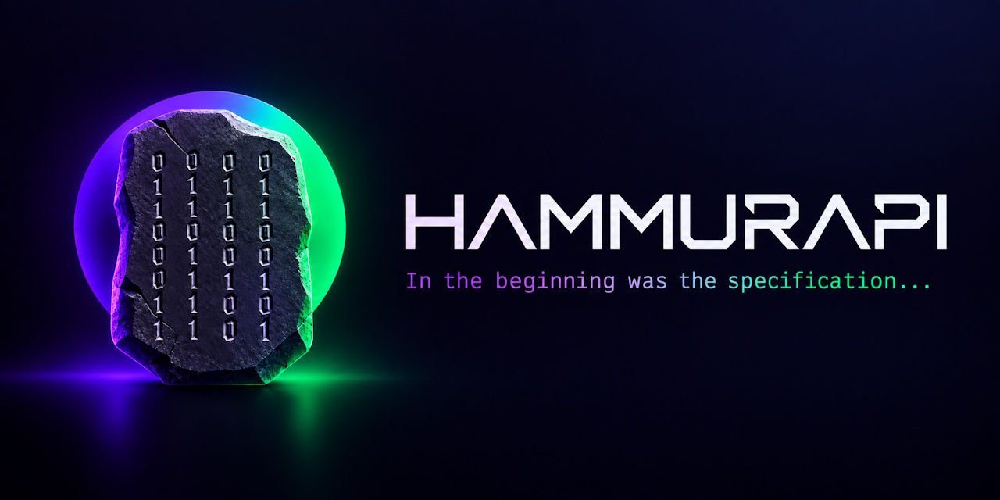

<p align="center">
  
</p>

# Hammurapi

**Hammurapi is a web platform where teams write product specifications together, pass them through
quality gates, and work with an AI agent as a partner — while git stays the source of truth for
every document.**

Product managers find it awkward to keep specifications directly in git and markdown, and wiki
tools are too generic: they don't enforce a sequence of reviews, don't keep approval history as
part of the process, and have no built-in agent. Hammurapi gives people a WYSIWYG editor, an
approval workflow and a chat with an agent, and writes everything as plain markdown into a git
repository, so a coding agent can pick up the finished specification.

This repository holds the **documentation, installer, Docker Compose setup, Helm chart and default
rules**. The code lives in two sibling repositories:

| Repository | What it is |
| --- | --- |
| [`hammurapi-core`](../hammurapi-core) | Backend: one Go binary with the modes `api`, `worker`, `cleaner`, `migrate` |
| [`hammurapi-web`](../hammurapi-web) | Frontend: React single-page app with the Milkdown editor |
| `hammurapi` (this one) | Docs, installer, `docker-compose.yml`, `Dockerfile.instance`, Helm chart, `rules/` |

## Contents

- [How it works](#how-it-works)
- [Features](#features)
- [Quick start](#quick-start)
- [Installation for your team](#installation-for-your-team)
- [Architecture](#architecture)
- [Repository layout](#repository-layout-of-a-hammurapi-instance)
- [Documentation](#documentation)
- [Development](#development)

## How it works

A **feature** is one increment of work inside a product system, for example `FMS.CAR-0005`
(domain `FMS`, system `CAR`, number `0005`). Its specification is split into up to five **gates**,
one per area, approved strictly in this order:

```text
product → design → arch → tech → qa → hand off
```

Each gate is a markdown document with a status:

```text
Draft ──submit──▶ Awaiting approval ──approve──▶ Approved
  ▲                                                 │
  └──────────── any edit (by a person or the agent) ┘
```

- **Any edit returns a gate to draft**, so an approval always covers the current text. A diff
  "since the last approval" shows exactly what changed.
- A gate can be approved only after every earlier gate of the feature is approved.
- When all gates are approved, **Hand off** merges the feature's PR/MR into the main branch; from
  then on the specification is read-only and changes go through a **fix feature** (a short
  specification that references its parent).
- Approval can be switched off per domain — handy when one person works on a product. Such
  features can be handed off at once, and the history records that they were handed off
  without approval.

Every feature has its own branch `feature/<ID>` and PR/MR. Every change is a commit made with the
user's own git account; Hammurapi keeps statuses, roles and history in its own database.

## Features

- **Quality gates** for product, design, architecture, tech and QA specifications, with
  sequential approval, history of every event (author, time, commit) and diffs since approval.
- **WYSIWYG editor** over markdown (CommonMark + GFM: tables, task lists), with deterministic
  serialization — opening and saving a document never produces a noisy diff.
- **AI agent as a partner** in a chat on every screen: research, search across specifications,
  drafts and edits. Two modes: *General questions* (read-only across all specs) and
  *Specification* (works on the open feature; edits only gates where the user is an editor and
  that are not approved). The agent cannot delete anything.
- **Voice input** (push-to-talk with a transcript you review before sending) and **attachments**
  with a history of all your files.
- **Personal agent**: its name and tone (business, friendly, concise, mentor) are yours to choose.
- **Roles per area**: editor, approver and area admin, in any combination, plus a global
  administrator. Everyone can read everything.
- **"Awaiting your approval"** on the home page, oldest first, updated live.
- **Rules**: document templates per area (`template.md`, `fix-template.md`) edited in the admin
  panel; a change becomes a PR/MR and applies only after **another** admin of that area approves.
- **Import from a zip archive** of existing specifications: preview with new IDs, errors and
  warnings, then one commit and PR/MR per feature, gates straight to *Awaiting approval*.
- **Deletion before hand-off**: a single area specification, or a whole feature (confirmed by
  typing its ID). Numbers are never reused.
- **Edit locks**: one editor per feature at a time; others see who is editing.
- **Five interface languages**: English (default), Russian, German, Spanish, Chinese (Simplified);
  light and dark theme; desktop and mobile layouts.
- **GitHub or GitLab** (cloud or self-hosted), one provider and one repository per instance.

## Quick start

A demo on your machine in a few minutes, without a GitHub/GitLab account or an LLM. It uses a
built-in **fake GitLab** and a **scripted agent** that only echoes — both for development only.

Requirements: Docker with Compose v2. `hammurapi-core` and `hammurapi-web` next to this directory
(the installer clones them if they are missing).

```sh
./install/install.sh --demo            # Linux, macOS, WSL, Git Bash
.\install\install.ps1 -Demo            # Windows PowerShell
```

Then open <http://localhost:8080>, choose **Sign in with GitLab** and pick `admin` (global
administrator) or any other login. As admin: create a domain and a system in
**Administration → Domains and systems**, give yourself roles in **Users and roles**, and create
your first feature.

To check the whole flow end to end: `scripts/e2e-smoke.sh` (64 checks against the running demo).

## Installation for your team

1. **Create the specifications repository** on GitHub or GitLab and copy [`rules/`](rules) into
   it — Hammurapi creates every new document from these templates.
2. **Register an OAuth application** with the callback URL
   `<PUBLIC_URL>/api/v1/auth/callback`:
   - GitLab: an application with scopes `api` and `read_user`;
   - GitHub: a GitHub App with user-to-server tokens (contents, pull requests and issues:
     read & write).
3. **Add a push webhook** to the repository: URL `<PUBLIC_URL>/hooks/v1/git`, secret
   `WEBHOOK_SECRET`. Statuses depend on it: every push to a feature branch is how Hammurapi learns
   about edits, including edits made directly in git.
4. **Choose the agent.** Hammurapi talks to an agent over the
   [Agent Client Protocol](https://agentclientprotocol.com) and runs it inside the `api`
   container. `Dockerfile.instance` builds that image; the `claude` target adds Claude Code via
   its ACP adapter.
5. **Run it:**
   - single host: `./install/install.sh` asks for the settings, writes `.env`, generates secrets
     and starts Docker Compose;
   - Kubernetes: the Helm chart in [`helm/hammurapi`](helm/hammurapi) (see
     [docs/deployment.md](docs/deployment.md)).
6. **Sign in** with a login listed in `BOOTSTRAP_ADMINS` — it becomes the first global
   administrator — and assign roles to your team.

## Architecture

```text
Browser ── SPA (hammurapi-web) ──▶ api ──────────▶ GitHub / GitLab API  (content: specs, rules)
              ▲   SSE                 │  ▲                 │
              │                       │  │ ACP (stdio)     │ push webhooks
              │                       │  agent ◀─ MCP tools│
              │                       ▼                    ▼
              │                   Postgres ◀── worker ◀── Kafka
              └──── NOTIFY ◀──────────┘         │
                                  MinIO (attachments, archives)   Whisper (voice)
```

| Component | Role |
| --- | --- |
| `api` | REST API for the SPA and admin panel, SSE stream, webhook intake, ACP agent pool, internal MCP server |
| `worker` | Consumes push events and import jobs from Kafka, updates the projection |
| `cleaner` | Daily job: expired attachments, sessions, locks, unconfirmed imports, leftover branches |
| `migrate` | Database migrations (goose), run before `api`/`worker` roll out |
| Postgres | Features, gates, statuses, history, users, roles, chat |
| Git provider | Source of truth for documents and rules; accessed only through its API, no local clone |
| Kafka | Push events (partitioned by feature, so edits of one feature are applied in order) and imports |
| MinIO / S3 | Chat attachments and import archives |
| Whisper | Speech recognition for voice input |
| Agent | ACP agent running as a subprocess of `api`; reaches Hammurapi only through MCP tools |

Key design decisions:

- **Git is the source of truth for content, Postgres for statuses.** Edits reach the database only
  through push webhooks, so an edit made directly in git resets approval just like one made in
  the UI.
- **No stale approvals.** Before approving, Hammurapi asks the provider for the latest commit of
  the gate and refuses if the database has not seen it yet.
- **The agent's permissions come from the user.** Each ACP session gets an MCP token scoped to the
  chat mode, the open feature and the areas where the user is an editor. There is no delete tool.
- **Sticky sessions**: a user's ACP session and SSE stream live in one `api` pod; if the user moves
  to another pod, the session is restored with `session/load` or from the chat history.

## Repository layout of a Hammurapi instance

```text
/rules
  /product/  template.md  fix-template.md
  /design/   template.md  fix-template.md
  /arch/     template.md  fix-template.md
  /tech/     template.md  fix-template.md
  /qa/       template.md  fix-template.md
/specs
  /<domain>/<system>/<feature ID>/<product|design|arch|tech|qa>/spec.md
  e.g. /specs/FMS/CAR/FMS.CAR-0005/product/spec.md
```

Fix documents start with front matter pointing to the parent: `parent: FMS.CAR-0005`. Commits made
by Hammurapi carry trailers — `Hammurapi-Feature`, `Hammurapi-Area`, `Hammurapi-Agent: true` for
agent edits, `Hammurapi-Import`, `Hammurapi-Delete` — so every change is traceable in git.

## Documentation

| Document | Contents |
| --- | --- |
| [docs/configuration.md](docs/configuration.md) | Every environment variable |
| [docs/git-providers.md](docs/git-providers.md) | GitHub App / GitLab application, webhook, repository setup |
| [docs/agent.md](docs/agent.md) | Connecting an ACP agent, MCP tools, sessions, instance image |
| [docs/deployment.md](docs/deployment.md) | Docker Compose and Kubernetes (Helm) |
| [docs/operations.md](docs/operations.md) | Health checks, metrics, logs, tracing, backups, troubleshooting |
| [docs/api.md](docs/api.md) | HTTP API overview and error codes |
| [docs/development.md](docs/development.md) | Local development, tests, fake GitLab and fake agent |

## Development

```sh
# backend (Go 1.27)
cd ../hammurapi-core && make test && make test-integration   # integration needs Docker

# frontend (Node 24)
cd ../hammurapi-web && npm ci && npm test && npm run dev      # dev server proxies to localhost:8080

# the whole stack
docker compose --profile demo up -d --build && scripts/e2e-smoke.sh
```

See [docs/development.md](docs/development.md).

## License

Apache License 2.0 — see [LICENSE](LICENSE).
