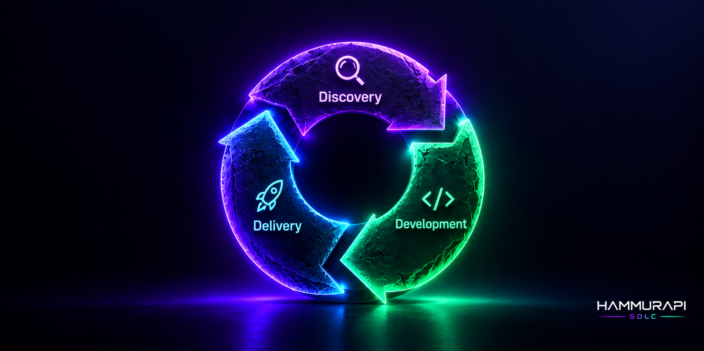

<p align="center">
  
</p>

# Hammurapi

**Hammurapi is a web platform that runs the whole product development cycle with an AI agent as a
partner — from an idea or a problem, through specifications with quality gates, to code, validation,
release and the value metric — while git stays the source of truth for every document and line of
code.**

Product managers find it awkward to keep specifications directly in git and markdown, wiki tools
don't enforce a sequence of reviews, and coding agents need a finished, approved specification to
work from. Hammurapi gives people a WYSIWYG editor, an approval workflow and a chat with an agent;
the agent researches issues, writes the technical and QA specifications, implements them in the
service repositories as pull requests, and a release goes out only after people sign it off.

This repository holds the **documentation, installer, Docker Compose setup, Helm chart and default
rules**. The code lives in two sibling repositories:

| Repository | What it is |
| --- | --- |
| [`hammurapi-core`](../hammurapi-core) | Backend: one Go binary with the modes `api`, `worker`, `agent`, `runner`, `cleaner`, `migrate`; the release image carries the Pi agent |
| [`hammurapi-web`](../hammurapi-web) | Frontend: React single-page app with the Milkdown editor |
| `hammurapi` (this one) | Docs, installer, `docker-compose.yml`, Helm chart, `rules/` |

## Contents

- [Hammurapi SDLC (H-SDLC)](#hammurapi-sdlc-h-sdlc)
- [How it works](#how-it-works)
- [Features](#features)
- [Quick start](#quick-start)
- [Installation for your team](#installation-for-your-team)
- [Architecture](#architecture)
- [Repository layout](#repository-layout-of-a-hammurapi-instance)
- [Documentation](#documentation)
- [Development](#development)

## Hammurapi SDLC (H-SDLC)

<p align="center">
  
</p>

The Hammurapi software development lifecycle (**H-SDLC**) has three stages — **Discovery**,
**Development** and **Delivery**. They go one after another in a circle: what a release teaches
you becomes the input of the next Discovery.

| Stage | What happens | What Hammurapi automates |
| --- | --- | --- |
| **Discovery** | An idea or a problem becomes an issue; its value and a way to measure it are worked out, and the issue is accepted into a feature | The agent analyses every new issue: value, a metric checked against a real metric source, context, similar issues and features |
| **Development** | The feature goes through the specifications — product, design, architecture, tech, QA — and becomes code | Quality gates in a strict order, generated tech and QA specifications, code generation into pull requests in every service, CI results linked to test cases |
| **Delivery** | The changes are merged, deployed and measured | Merge in the service order, deploy, feature flags, the value metric against its target, confirmation — or one-click rollback |

**Hammurapi automates this lifecycle.** People make the decisions — accept an issue, approve a
specification, sign the validation, confirm a release — and Hammurapi with its AI agent does the
work between them. Every step is a durable workflow, so nothing is lost on a restart, and git stays
the source of truth for every document and line of code. Delivery closes the circle: the value
metric of a release confirms the feature, and a rollback returns its issues to Discovery.

## How it works

The H-SDLC stages are the pages of the web app:

```text
Discovery     issue ISS.FMS.CAR-0012 (idea | problem)
              → Analysis: the agent writes value, metric and context, finds similar work
              → an expert accepts it into a feature
Development   feature FTR.FMS.CAR-0005
              → product → design → arch  (people write, experts approve)
              → tech, qa                 (generated by the agent, approved by experts)
              → code generation: one task per service, a PR in every repository
              → validation: CI results per QA test case, product and technical signatures
Delivery      release RLS.FMS.CAR-0003
              → merge in the service order → deploy → feature flag → value metric → confirm
              → or rollback: revert, redeploy, flag off, issues back to Discovery
```

Each gate is a markdown document with a status:

```text
Draft ──submit──▶ Awaiting approval ──approve──▶ Approved
  ▲                                                 │
  └──────────── any edit (by a person or the agent) ┘
```

- **Any edit returns a gate to draft**, so an approval always covers the current text. A diff
  "since the last approval" shows exactly what changed.
- A gate can be approved only after every earlier gate is approved, by a **product** or
  **technical expert** of the domain. Requirements need IDs (`**R1.**`) so tests and code can
  trace back to them.
- When the human gates are approved, the agent generates the tech and QA specifications from
  the rules and the services of the domain; they are read-only and can be regenerated.
- Every step after that is a **durable workflow** in Postgres: restarts never lose it, failed
  effects are retried, and a step that keeps failing blocks the run with the reason and waits on
  the General page for someone to retry or roll back.

Every feature has its own branch and PR/MR in the specification repository, and one branch and PR
per service repository. People commit with their own git account; the agent commits as a bot, and
every commit carries trailers linking it to the feature, the task and the initiator.

## Features

- **General page**: what waits for *you* (approvals, signatures, blocked steps, confirmations),
  and a board of Discovery, Development and Delivery, updated live.
- **Discovery**: issues from people or the agent, **Analysis** by the agent (value, a measurable
  metric checked against a real metric source, context, similar issues and features); accept,
  reject, merge or move.
- **Quality gates** for product, design, architecture, tech and QA specifications, with
  sequential approval, history of every event (author, time, commit) and diffs since approval.
- **Code generation**: a runner task per service (a Kubernetes Job with the agent in a sandbox),
  autonomy chosen by the service owner (`plan`, `pr`, `autonomous`), review comments on the PR
  go back to the agent, and a coverage matrix of requirements → services → test cases → PRs.
- **Validation**: JUnit results from CI linked to QA test cases, optional stage deploy and e2e,
  product and technical signatures.
- **Releases**: merge in the order of the tech specification, deploy through GitHub Actions,
  GitLab CI or a webhook (or a manual mark), feature flags, the value metric, confirmation and
  one-click **rollback**.
- **Services and domains** from a **Backstage catalog** or entered by hand; catalog owners become
  domain experts and service owners.
- **WYSIWYG editor** over markdown (CommonMark + GFM: tables, task lists), with deterministic
  serialization — opening and saving a document never produces a noisy diff.
- **AI agent as a partner** in a chat on every screen, aware of the open issue, feature or release;
  it acts only within the user's permissions and cannot delete anything.
- **Voice input** (push-to-talk with a transcript you review before sending), **attachments** and
  a **personal agent** name and tone.
- **Rules**: document templates per area edited in the admin panel; a change becomes a PR/MR and
  applies only after **another** admin of that area approves.
- **Import from a zip archive** of existing specifications, **edit locks**, deletion with
  confirmation (numbers are never reused).
- **Five interface languages**: English (default), Russian, German, Spanish, Chinese (Simplified);
  light and dark theme; desktop and mobile layouts.
- **GitHub or GitLab** (cloud or self-hosted), one provider per instance.

## Quick start

A demo on your machine in a few minutes, without a GitHub/GitLab account or an LLM. It uses a
built-in **fake GitLab** (specification and service repositories, CI, deploys, a Prometheus
endpoint) and a **scripted agent** that writes Discovery, generated gates and code by a script —
both for development only.

Requirements: Docker with Compose v2. `hammurapi-core` and `hammurapi-web` next to this directory
(the installer clones them if they are missing).

```sh
./install/install.sh --demo            # Linux, macOS, WSL, Git Bash
.\install\install.ps1 -Demo            # Windows PowerShell
```

Then open <http://localhost:8080>, choose **Sign in with GitLab** and pick `admin` (global
administrator) or any other login. As admin: create a domain and a system in
**Administration → Domains and systems**, make yourself its product and technical expert, add the
services `demo/booking` and `demo/pricing` in **Administration → Services**, then press
**New issue**.

To check the whole cycle end to end — issue, Discovery, gates, code generation, validation,
release and rollback: `scripts/e2e-smoke.sh` against the running demo.

## Installation for your team

1. **Create the specifications repository** on GitHub or GitLab and copy [`rules/`](rules) into
   it — Hammurapi creates every new document from these templates.
2. **Register an OAuth application** with the callback URL
   `<PUBLIC_URL>/api/v1/auth/callback`:
   - GitLab: an application with scopes `api` and `read_user`;
   - GitHub: a GitHub App with user-to-server tokens (contents, pull requests and issues:
     read & write).
3. **Add a webhook** (push, tag, merge request / pull request, review and comment events) to the
   specification repository **and every service repository**: URL `<PUBLIC_URL>/hooks/v1/git`,
   secret `WEBHOOK_SECRET`. This is how Hammurapi learns about edits, PRs, reviews and tags,
   including changes made directly in git.
4. **Set up the bot**: the GitHub App installed on all repositories, or a GitLab bot account with
   `GITLAB_BOT_TOKEN`. Then connect CI results, deploy, feature flags, the catalog and metric
   sources — see [docs/cycle.md](docs/cycle.md).
5. **Connect an LLM.** The agent is [Pi](https://www.npmjs.com/package/@earendil-works/pi-coding-agent),
   run by Hammurapi's agent operator from the core image. Give it a DeepSeek key with
   `BOOTSTRAP_DEEPSEEK_API_KEY`, or add the connection after the first sign-in in
   **Administration → Agent**, where models per scenario, skills and MCP servers are set too
   (see [docs/agent.md](docs/agent.md)).
6. **Run it:**
   - single host: `./install/install.sh` asks for the settings, writes `.env`, generates secrets
     and starts Docker Compose;
   - Kubernetes: the Helm chart in [`helm/hammurapi`](helm/hammurapi) (see
     [docs/deployment.md](docs/deployment.md)).
7. **Sign in** with a login listed in `BOOTSTRAP_ADMINS` — it becomes the first global
   administrator — and make your team area admins and domain experts.

## Architecture

```text
Browser ── SPA (hammurapi-web) ──▶ api ──────────────▶ GitHub / GitLab API
              ▲   SSE               │ ▲  ▲ :8081 internal   (specs, service repos, CI, tags)
              │                     │ │  └──────── runner Jobs (one per service task)
              │                     │ │ MCP tools      ▲ workspace │ webhooks: git, CI results,
              │                     ▼ │                │ :8095     │ deploy, feature flags
              │             agent operator (Pi) ◀── sessions ── api, worker, runner Jobs ──▶ LLM
              │                     ▼                            ▼
              │                 Postgres ◀──── worker ◀── Kafka
              └──── NOTIFY ◀────────┘  workflows │ agent scenarios (Analysis, gates, checks)
                             MinIO (attachments, archives)   Whisper (voice)   metric sources
```

| Component | Role |
| --- | --- |
| `api` | REST API for the SPA and admin panel (including Administration → Agent), SSE stream, webhook intake (git, CI results, deploy, flags), the chat, internal API on `:8081` (MCP, runner tasks) |
| `worker` | Kafka consumers (git events, imports), the workflow engine (Discovery, gate generation, code generation, validation, release, rollback), agent scenarios through the operator, runner Jobs, daily catalog sync |
| `agent` | The agent operator: a Pi process per chat or task session, with the model, key, skills and MCP servers of the scenario |
| `runner` | One code task: checks out a service repository through the provider API, opens an agent session and serves the checkout to Pi's file and shell tools, commits as the bot, opens or updates the PR |
| `cleaner` | Daily job: expired attachments, sessions, locks, unconfirmed imports, leftover branches |
| `migrate` | Database migrations (goose), run before `api`/`worker` roll out |
| Postgres | Issues, features, gates, tasks, releases, workflow runs and outbox, users, roles, chat |
| Git provider | Source of truth for documents, rules and code; accessed only through its API, no local clone |
| Kafka | Git events (partitioned by repository and feature, so changes are applied in order) and imports |
| MinIO / S3 | Chat attachments and import archives |
| Whisper | Speech recognition for voice input |
| LLM | The administrator's connection (DeepSeek in the first release); errors are shown in plain words, usage and cost are counted per scenario |

Key design decisions:

- **Git is the source of truth for content, Postgres for statuses.** Edits reach the database only
  through push webhooks, so an edit made directly in git resets approval just like one made in
  the UI.
- **No stale approvals.** Before approving, Hammurapi asks the provider for the latest commit of
  the gate and refuses if the database has not seen it yet.
- **The agent's permissions come from the user or the task.** Each chat session gets an MCP grant
  scoped to the user's roles and the open issue, feature or release; each background session and
  runner task gets a grant for its one job (Discovery of an issue, generation of a gate, the code
  of one service). There is no delete tool.
- **Durable workflows.** Every cycle step is a state machine persisted in Postgres with an outbox
  of effects; workers lease runs with `SKIP LOCKED`, retry effects with backoff, and block a run
  with the reason instead of failing silently.
- **Untrusted code stays in a sandbox.** Runner Jobs have no service account token, a read-only
  root filesystem, a deadline and a NetworkPolicy; they get a short-lived git token for their one
  repository from the internal API.
- **Agent sessions live in the operator**: one Pi process per chat or task session; an idle chat
  session is saved to S3 and restored with the next message, so `api` stays stateless (sticky
  sessions only keep the streamed answer on the user's SSE connection).

## Repository layout of a Hammurapi instance

```text
/rules
  /product/  template.md  fix-template.md
  /design/   template.md  fix-template.md
  /arch/     template.md  fix-template.md
  /tech/     template.md  fix-template.md
  /qa/       template.md  fix-template.md
/specs
  /<domain>/<system>/<feature key>/discovery.md
  /<domain>/<system>/<feature key>/<product|design|arch|tech|qa>/spec.md
  e.g. /specs/FMS/CAR/FTR.FMS.CAR-0005/product/spec.md
```

Commits made by Hammurapi carry trailers — `Hammurapi-Feature`, `Hammurapi-Area`,
`Hammurapi-Agent` for agent edits, `Hammurapi-Generated` for generated gates, `Hammurapi-Task`,
`Hammurapi-Req` and `Hammurapi-Initiator` for code, `Hammurapi-Release` for merges and reverts,
`Hammurapi-Import`, `Hammurapi-Delete` — so every change is traceable in git.

## Documentation

| Document | Contents |
| --- | --- |
| [docs/configuration.md](docs/configuration.md) | Every environment variable |
| [docs/git-providers.md](docs/git-providers.md) | GitHub App / GitLab application, webhook, repository setup |
| [docs/cycle.md](docs/cycle.md) | Development cycle: bot, services and catalog, runner, CI results, deploy, feature flags, metric sources, releases |
| [docs/agent.md](docs/agent.md) | The Pi agent and its operator, Administration → Agent, MCP tools, LLM errors, fakellm |
| [docs/deployment.md](docs/deployment.md) | Docker Compose and Kubernetes (Helm) |
| [docs/operations.md](docs/operations.md) | Health checks, metrics, logs, tracing, backups, troubleshooting |
| [docs/api.md](docs/api.md) | HTTP API overview and error codes |
| [docs/development.md](docs/development.md) | Local development, tests, fake GitLab and fake agent |

## Development

```sh
# backend (Go 1.27)
cd ../hammurapi-core && make test && make test-integration   # integration needs Docker

# frontend (Node 24)
cd ../hammurapi-web && npm ci && npm test && npm run dev      # dev server proxies to localhost:8080

# the whole stack
docker compose --profile demo up -d --build && scripts/e2e-smoke.sh
```

See [docs/development.md](docs/development.md).

## License

Apache License 2.0 — see [LICENSE](LICENSE).
